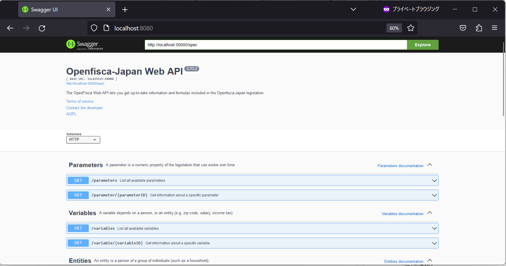
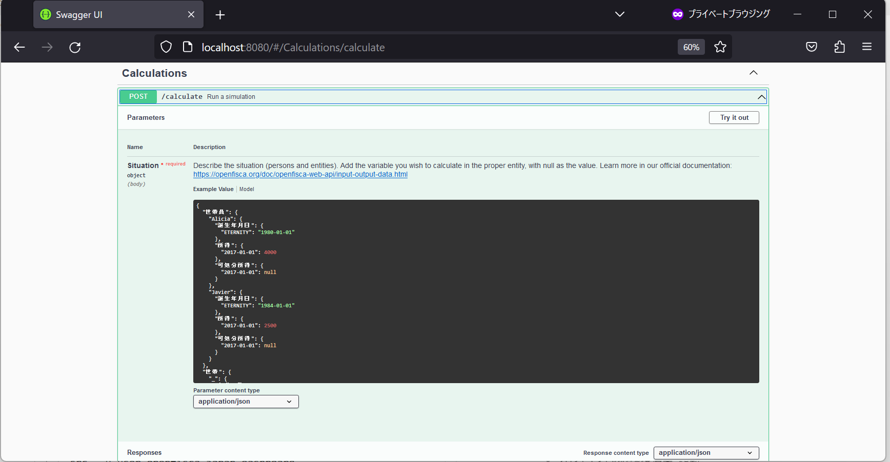
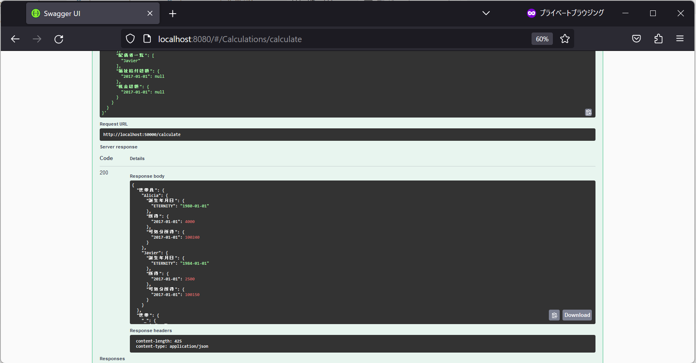

# 開発ドキュメント

## 環境構築

1. Docker Desktopをインストールして起動する。
    - Windowsの場合：[WindowsでのDocker Desktop環境構築](https://chigusa-web.com/blog/windows%E3%81%ABdocker%E3%82%92%E3%82%A4%E3%83%B3%E3%82%B9%E3%83%88%E3%83%BC%E3%83%AB%E3%81%97%E3%81%A6python%E7%92%B0%E5%A2%83%E3%82%92%E6%A7%8B%E7%AF%89/)
    - Macの場合：[MacでのDocker Desktop環境構築](https://matsuand.github.io/docs.docker.jp.onthefly/desktop/mac/install/)

1. proj-inclusiveのOpenFisca-Japan Githubリポジトリをフォークし、ローカル環境（自分のPC）にクローン（ダウンロード）する。 **developブランチ** をチェックアウトする。  
  [フォーク・クローン・プルリクエストの流れ](https://techtechmedia.com/how-to-fork-github/)    
   リポジトリのクローンはGithub desktop, Source treeなどのツールを使うのが簡単です。
1. 自分のPC上にクローンしたOpenfisca-Japanのルートディレクトリで、WindowsならPowershell、MacならTerminalを開く。  
以下の手順でフロントエンド・バックエンドの環境構築・起動を行う。  
環境は同時に複数起動できない。  
そのため、環境を変える場合は元の環境を停止してから新しく起動する。

    - フロントエンド・バックエンドを一括で環境構築・起動  
      ```bash
      # docker環境を構築・起動
      docker-compose up --build
      # 「Ctrlキー＋c」でdocker環境を停止
      ```

    - バックエンドのみ環境構築・起動  
      ```bash
      # docker環境を構築
      docker build ./ -t openfisca_japan
      # docker環境を起動
      docker run -it --rm -p 50000:50000 -v "$(pwd):/app" -u user openfisca_japan
      # $(pwd)はDockerfileが存在するディレクトリの絶対パスで置き換える必要があるかもしれません。
      # docker環境を終了
      exit
      ```
  
    - バックエンド(swagger-ui&openfisca)を環境構築・起動
      ```bash
      # docker環境を構築・起動
      docker compose up -d swagger-ui
      # ブラウザでSwagger-UIを表示する
      http://localhost:8080
      # docker環境を停止・破棄
      docker compose down -v
      ```
      
      Swagger-UIでopenfiscaの動作確認
      
    　
      

    - フロントエンドのみ環境構築・起動  
      ```bash
      # dashboardのディレクトリに移動
      cd dashboard
      # docker環境を構築
      docker build ./ -t openfisca_japan_dashboard
      # docker環境を起動
      docker run -it --rm -p 30000:30000 -v "$(pwd)/src:/app/src" openfisca_japan_dashboard
      # docker環境を終了
      exit
      # 元のディレクトリに戻る
      cd ..
      ```
    - フロントエンドを起動している場合は
      http://localhost:30000/ をブラウザに打ち込むとフォームが表示されます。

### Dockerを使わない環境構築方法（参考）
#### GitHub Codespaceを使用する方法
Dockerを自分のPCにインストールする必要はありませんが、操作性はやや悪いです。

- このリポジトリ を自分の GitHub アカウントに Fork する or 既に Fork してる場合は Fetch upstream する（必須）
- → Fork した自分のアカウントの側のリポジトリをブラウザで開き、緑色の「Code」ボタンをクリック
- → 「Create codespace on main」をクリック
- → 「Open this codespace in VS Code Desktop」をクリック
- → ダイアログが数回表示されるので全部 OK っぽい方をクリック
- → VSCode と GitHub を連携させるために認証が求められるので承認する
- → VSCode で GitHub Codespaces に無事に接続できたら、動作確認のために、ターミナルで `make` を実行

これだけで全員同じ環境で開発できるようになるはず。料金は 2022-07-02 現在、無料です。

##### このリポジトリを GitHub であなたのアカウントへ Fork して、 `git clone` する

##### Fork したあなたのリポジトリで、GitHub Codespaces を起動して、Visual Studio Code で開く

[](https://gyazo.com/a29c4cce16baca1b33978231849b2269)
[](https://gyazo.com/1351c39a5ac9a4f5a4a4ae9901ec12d6)

##### GitHub Codespaces で動作確認する

```bash
make
```

##### GitHub Codespaces で API サーバーとして動かす

```bash
make serve-local
```

- GET http://localhost:50000/spec
- GET http://localhost:50000/entities
- GET http://localhost:50000/variables
- GET http://localhost:50000/parameters

## 開発方法

### ディレクトリ構成

主なディレクトリ

- `dashboard`: フロントエンド(React製)
  - `cypress`: e2eテスト
  - `src`: アプリのソースコード
    - `assets`: 画像等のファイル
    - `components`: UIを構成するReactコンポーネント
    - `config`: 制度情報や自治体名等のデータ
    - `contexts`: アプリ全体で共有するデータを保持するためのReact context
    - `hooks`: 状態管理を行うためのReact hooks
- `oepnfisca_japan`: バックエンド(OpenFisca製、詳細は[OpenFiscaについて](./about_openfisca))
  - `assets`: 制度の計算に使用する金額等のデータ(csv)
  - `parameters`: 制度計算に使用する金額等のデータ(yaml)
  - `tests`: 制度のユニットテスト
  - `variables`: 制度の計算式を表すクラス(Python)

### バックエンド

#### 事前準備
- バックエンドのdocker環境に入る

#### テスト実行
- 全てのテストを実行 (変更内容の影響範囲が大きい場合またはmainブランチマージ時は、デグレードを検知するため実行してください。)
  - `make test` 
- 一部のテストを実行
  - `openfisca test --country-package openfisca_japan openfisca_japan/tests/<実行したいテストファイル或いはディレクトリパス>`
    - 上記コマンド実行時にテストファイル（~.yaml）を読み込みます
    - そのため、テストファイルのみ修正する場合はそれ自身を修正してコマンド実行すれば良いです

#### 内部計算方法の修正
- openfisca_japan/variables/~.py等の計算方法を規定するファイルを修正する
- 以下のコマンドでビルドを行わないとテスト時に修正が反映されない
  - `make build`
- その後、上述のテストを行う
- 通常は標準出力は表示されませんが、例外を発生させると標準出力が表示されデバッグが容易になります
- フロントエンドの制約上、見積もり結果に表示する制度のVariableは **`entity = 世帯` にする必要がある**
  - 個人に依存する条件は世帯員単位で計算し、最終的な制度の金額のみ世帯単位で集計すると実装しやすいです

#### テスト条件・結果を記載したCSVファイルから、yamlのテストファイルを自動生成する方法

```bash
cd tools/make_tests
bash generate.sh
```

- 上記コマンドで openfisca_japan/tests/generated 以下にyamlのテストファイルが作成される
  - そのテストファイルを上述の方法でテストする
- 生成ファイルの形式を変えたい場合、新しい制度に対応する場合は `tools/make_tests/mylib/mymodule` 配下の生成スクリプトを修正する

#### Variableの依存関係を確認する方法

```bash
python tools/dependency_graph/dependency.py
```

- 上記コマンドで `tools/dependency_graph/dependency_graph.png` にopenfisca_japan全体のVariableの依存関係図が作成される
  - `A -> B` はVariable `A` の計算式に Variable `B` を使用していることを表す
  - 他のVariableに依存していない場合青色で表示される
- 実行には事前に [Graphviz](https://graphviz.org/) のインストールが必要

```bash
# Ubuntuの場合
sudo apt install graphviz
python -m pip install graphviz
sudo apt install xdg-utils
```

### フロントエンド
- ルートディレクトリで以下コマンドを打ち、フロントエンドとバックエンドのDocker環境を一括で起動する
  - `docker compose up --build`
- `cd dashboard` でdashboardディレクトリにて開発する。
- http://localhost:30000/ をブラウザに打ち込み、ページを確認する。

#### テスト、linter実行

```bash
# dashboardディレクトリに移動
cd dashboard

# linter
npm run lint
npm run pretty:check

# formatter (上記でエラーが出た場合に解消)
npm run pretty

# テスト実行
npm run cy:run
```

### 制度追加の流れ（バックエンド、フロントエンド開発の連携）

- 1. 制度に必要な世帯、世帯員情報の洗い出し
- 2. 制度情報の入力、出力の決定
  - ※フロントエンドの仕様上、`見積もり結果`に表示する制度は世帯単位で算出する必要がある（個人に支給される支援であっても）
  - 必要情報が多くフォームの入力負荷が高い場合、一部入力を省く代わりに幅のある結果（最大、最小）を返す選択肢もある
- 3. バックエンド側で制度に対応するVariableを実装
  - ※制度のVariableは`entity = 世帯`にする必要がある（フロントエンド側の制約）
  - 結果に幅がある場合、Variable名を`{制度名}_最大`, `{制度名}_最小`とする
  - 必要があれば依存する計算式を別Variableに実装（こちらは個人単位でもよい）
    - 別のVariableから計算できない場合、ユーザーから受け取る必要があるためフロントエンド側にフォーム追加が必要
- 4. フロントエンド側でフォームを実装
  - ※バックエンド側で制度に対応するVariableが未定義の場合APIがエラーを返す
    - フロントエンド側を先行開発したい場合はバックエンド側に空のVariableを実装しておく
  - フォームの入力情報を `household` に設定することでバックエンドへのリクエストに含める
    - リクエスト形式はバックエンド側のユニットテスト（yamlファイル）の`input.世帯`, `input.世帯員` の形式を参照
      - `./openfisca_japan/tests/`
    - 見積もり結果に制度を表示するには `dashboard/src/config/app_config.json` への追加が必要

## デプロイ方法

### 新バージョンのリリース

- 以下の内容を `develop` ブランチへマージ
  - `docs/change_log.md` の更新
  - バックエンド `OpenFisca-Japan` パッケージのバージョン表記の更新
    - `requirements.txt`
    - `setup.py`
  - (必要であれば) `README.md` の概要に対応制度追加
- [開発版のページ](https://develop.openfisca-japan.pages.dev/)で見積もり結果が正常に表示されることを確認
- ビルドしたwheelパッケージをPyPIにアップロード
  - シミュレーションが簡便に実行できるよう、wheelパッケージをPyPIにアップロードしてpipでインストールできるようにする。
  - `make build`でwheelパッケージをビルドする。(distフォルダにパッケージが作成される)
  - [【PyPI 】Pythonの自作ライブラリをpipに公開する方法#PyPIへのユーザ登録](https://qiita.com/c60evaporator/items/e1ecccab07a607487dcf#pypi%E3%81%B8%E3%81%AE%E3%83%A6%E3%83%BC%E3%82%B6%E7%99%BB%E9%8C%B2)を参考に、テスト用PyPIと本番用PyPIにパッケージをアップロードする。  
  テスト用PyPIからOpenFisca-Japanをインストールすると、必要な依存ライブラリはテスト用PyPIからインストールされるため、テスト用PyPIには存在しないものは手動で通常の本番用PyPIからインストールする。(OpenFisca-Core等)
- developブランチからmainブランチへのPR作成、マージ
- [本番のページ](https://shien-yadokari.proj-inclusive.org/)で見積もり結果が正常に表示されることを確認
  - mainブランチマージ後1分程度切り替わりのためバックエンドの404エラーが発生する可能性あり
- TagとReleaseの作成
  - `Releases` -> `Draft a new release` を選択
  - `Choose a tag` へリリースしたいバージョンを入力し `Create a new tag`
  - タイトルにバージョン、本文にリリースの概要を記載し `Publish release`

### バックエンド（OpenFisca Python APIサーバー）

#### 自動build, deploy
以下より、バックエンド・フロントエンドともにmain, developブランチが独立した環境で自動ビルド・デプロイされる。
- Google CloudのCloud Buildにより、mainブランチ、developブランチにpull (push) されたとき、それぞれ`./cloudbuild.yaml`, `./cloudbuild-dev.yaml`をもとに`./Dockerfile_cloud`のイメージがビルドされ、Cloud Runにより異なるURLでdeployされる。
- Cloudflare Pagesの環境変数をmainブランチとdevelopブランチで変えることで、それぞれ上記の個別のバックエンドAPIにPOSTする。

#### ローカルでdockerイメージを作りcloud runにデプロイする（参考）
- `docker build -t gcr.io/openfisca-shibuya/openfisca-shibuya-deploy-test -f Dockerfile_cloud --platform amd64 .`
  - M1 Macの場合、`--platform amd64`が必要
- `docker push gcr.io/openfisca-shibuya/openfisca-shibuya-deploy-test:latest`
  - でGCPのcontainer registoryに保存される
- Cloud Runでアップしたdocker imageを選択してデプロイする
- Makefile内の環境変数は`$hoge`では認識されない。他の記載方法がある？

### フロントエンド
- Cloudflare Pagesでmainブランチ、developブランチにpull (push)時にbuild, deployされる。

- developブランチのデプロイURLは[https://develop.openfisca-japan.pages.dev/](https://develop.openfisca-japan.pages.dev/)

## TroubleShooting

### Frontend

- When `npm ci` in `dashboard/Dockerfile`, this error happened and docker image can't be made.

  ```
  npm verb cli /usr/local/bin/node /usr/local/bin/npm
  npm info using npm@9.6.7
  npm info using node@v18.17.0
  npm verb cache could not create cache: Error: ENOENT: no such file or directory, mkdir '/home/user/.npm'
  npm verb logfile could not create logs-dir: Error: ENOENT: no such file or directory, mkdir '/home/user/.npm'
  npm verb title npm ci
  npm verb argv "ci" "--loglevel" "verbose"
  npm verb logfile logs-max:10 dir:/home/user/.npm/_logs/2023-07-29T13_01_14_844Z-
  npm verb logfile could not be created: Error: ENOENT: no such file or directory, open '/home/user/.npm/_logs/2023-07-29T13_01_14_844Z-debug-0.log'
  npm verb logfile no logfile created
  npm verb stack Error: ENOENT: no such file or directory, mkdir '/app/node_modules'
  npm verb cwd /app
  npm verb Linux 5.10.104-linuxkit
  npm verb node v18.17.0
  npm verb npm  v9.6.7
  npm ERR! code ENOENT
  npm ERR! syscall mkdir
  npm ERR! path /app/node_modules
  npm ERR! errno -2
  npm ERR! enoent ENOENT: no such file or directory, mkdir '/app/node_modules'
  npm ERR! enoent This is related to npm not being able to find a file.
  npm ERR! enoent 
  npm verb exit -2
  npm verb unfinished npm timer reify 1690635675079
  npm verb unfinished npm timer reify:createSparse 1690635675086
  npm verb code -2

  npm ERR! Log files were not written due to an error writing to the directory: /home/user/.npm/_logs
  npm ERR! You can rerun the command with `--loglevel=verbose` to see the logs in your terminal
  ```

  This error is resolved by add `npm cache clean --force` by root user in Dockerfile.

  The cause is not unknown.   
  It is also unknown whether this error occurs only on the one local PC or in any environment.  
  In Netlify depoloy environment, the error is probably not occured.  
  The error may have happened when the node:18-bullseye docker image went up from 18.16 to 18.17, but same error occured when reversion back to 16. 

### Backend

- (for Windows) 環境変数を利用して Python に UTF-8 を強制させる  
Unicode Decoding Error が起きるときもこちらの通りにしてください。
Powershell を起動し以下のコマンドを入力して下さい。

  ```powershell
  $env:PYTHONUTF8=1
  ```

- インストールされているPythonのバージョンが、OpenFiscaで使用しているものと異なる
Dockerコンテナは正常動作するのにエディタ上構文エラーが表示される場合、ローカルにインストールしているPythonがOpenFiscaが要求するバージョンと異なる可能性があります。
`Dockerfile` に記載されているバージョンのPythonをインストールしてください。
`pyenv` を使うと、複数バージョンのPythonをコマンドで切り替えることが可能です

https://github.com/pyenv/pyenv

- `make build` 時に `ERROR: Failed building wheel for numpy` というエラーで失敗する
古いバージョンのPython、OpenFiscaでビルドした生成物が残っていてエラーが発生している可能性があります。以下を試してみてください。
  - (OpenFiscaコンテナ内で作業している場合) `docker compose down` して再度 `docker compose up -d --build`
  - `dist` ディレクトリの中身を削除して再度 `make build`
- PR作成時に、GitHub actionsの `make check-style` で失敗する
  - linterの指示に従ってソースコードを整形してください
  - `複数世帯の場合に正しく計算できないため...` というエラーが出た場合、[複数世帯に対応した実装方法](./about_openfisca.md#複数世帯に対応した実装方法) を参考に実装を修正してください
    - linterの誤検知への対処等で指摘を意図的に無視したい場合はコメント `# noqa: {ルール名}` を記載
