# 紹介状機能 画面遷移一覧

トップページ右下の「紹介状 β版」から紹介状を生成するまでの、標準的な画面遷移です。

- [納品先への確認事項](stakeholder-confirmation.md)

- 表示幅：402 px相当（スマートフォン）
- 対象分野：高齢分野
- 回答例：各質問の先頭の選択肢
- 困りごと：主な困りごと1件、その他の困りごと3件
- 氏名・メールアドレス・自由記述：未入力

## 遷移概要

`トップページ` → `機能説明` → `利用前の確認` → `分野選択` → `質問1〜7` → `主な困りごと選択` → `その他の困りごと選択` → `任意入力` → `完成画面`

## 条件分岐と後続プロセス

### 紹介状を作成するまでの分岐

ひし形が判定、四角形が画面または処理を表します。「次へ／完了が無効」は、その条件を満たすまで同じ画面に留まることを意味します。

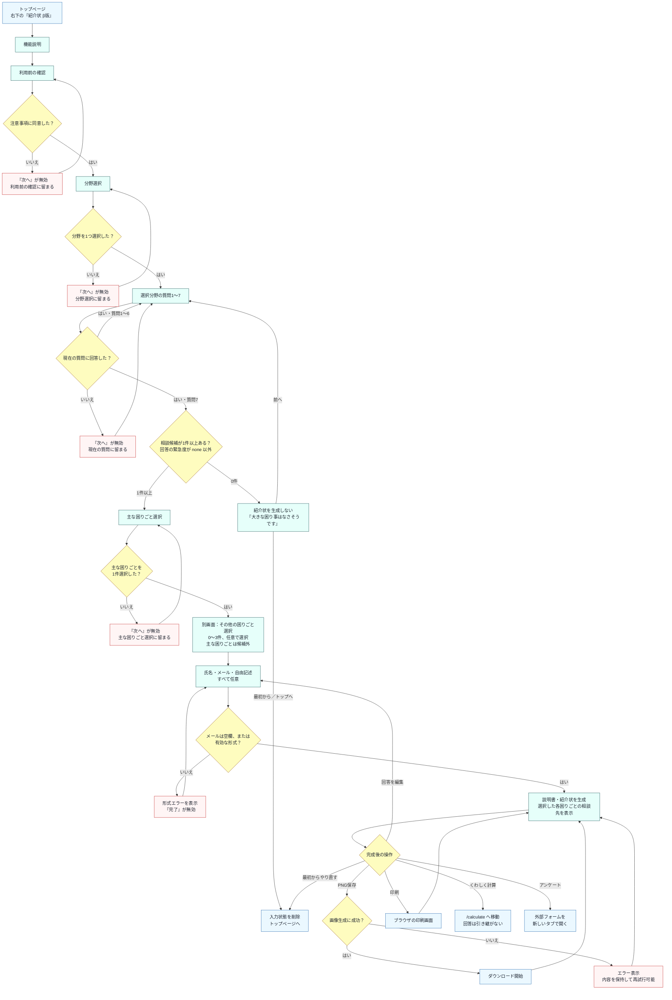

### セッション保存・再開時の分岐

紹介状の回答はURLやサーバーには送らず、同じタブの `sessionStorage` に保存します。ホームへ戻る操作と、明示的に「最初からやり直す」操作では、保存状態の扱いが異なります。

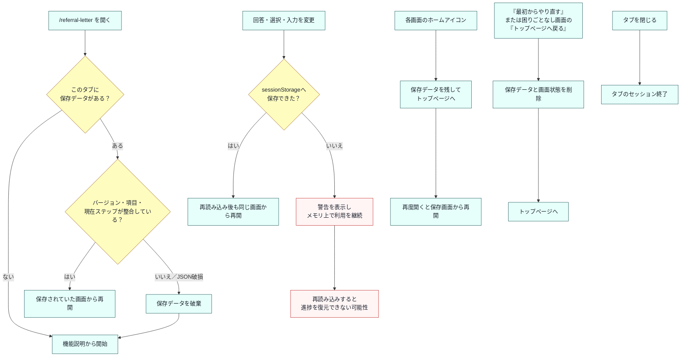

### 分岐条件の補足

| 分岐タイミング       | 条件                                 | 条件を満たさない場合                     | 条件を満たした後                        |
| -------------------- | ------------------------------------ | ---------------------------------------- | --------------------------------------- |
| 利用前の確認         | 同意チェックがオン                   | 「次へ」が無効                           | 分野選択へ進む                          |
| 分野選択             | 3分野から1件を選択                   | 「次へ」が無効                           | 選択分野の質問1へ進む                   |
| 各質問               | 現在の質問に1件回答                  | 「次へ」が無効                           | 次の質問へ進む。質問7では候補判定を行う |
| 質問7の完了          | `urgency !== none` の回答が1件以上   | 困りごとなし画面へ進み、紹介状は作らない | 困りごと選択へ進む                      |
| 主な困りごと選択     | 主な困りごとを1件選択                | 「次へ」が無効                           | その他の困りごと選択画面へ進む          |
| その他の困りごと選択 | 0〜3件を任意で選択                   | 選択なしでも進める                       | 任意入力へ進む                          |
| 任意入力             | メールが空欄、または形式が有効       | エラーを表示して「完了」が無効           | 説明書・紹介状を生成する                |
| PNG保存              | ブラウザで画像を生成できる           | エラーを表示し、内容を保持したまま再試行 | ダウンロードを開始する                  |
| セッション復元       | 保存データの形式と現在ステップが整合 | 保存データを破棄し、機能説明から開始     | 保存されていた画面から再開する          |

### 戻る・編集で変わる状態

- 分野を別の分野へ変更すると、7問の回答・主な困りごと・その他の困りごとは解除されます。氏名・メール・自由記述は維持されます。
- 回答を変更して、選択済みの困りごとが相談候補でなくなった場合、その主・その他の選択は自動解除されます。
- 質問1の「前へ」は分野選択へ、質問2〜7は1つ前の質問へ戻ります。
- 主な困りごと選択の「前へ」は質問7へ、その他の困りごと選択の「前へ」は主な困りごと選択へ、任意入力の「前へ」はその他の困りごと選択へ戻ります。
- 完成画面の「回答を編集」は任意入力へ戻り、回答・困りごと・入力内容を維持します。
- 完成画面から「くわしく計算」へ移動しても紹介状の保存状態は残りますが、見積もり画面へ回答内容は引き継がれません。

### 代表的な分岐画面

| 相談候補が0件                                                                                        | メール形式が無効                                                                                         |
| ---------------------------------------------------------------------------------------------------- | -------------------------------------------------------------------------------------------------------- |
| 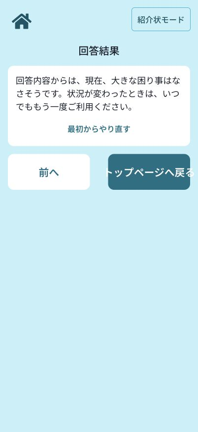 |  |
| 紹介状を生成せず、質問7へ戻るか状態を削除してトップへ戻る。                                          | 入力内容を保持したまま、形式を修正するまで「完了」を無効にする。                                         |

## 画面一覧

| 1. トップページ                                                                             | 2. 機能説明                                                                       |
| ------------------------------------------------------------------------------------------- | --------------------------------------------------------------------------------- |
| 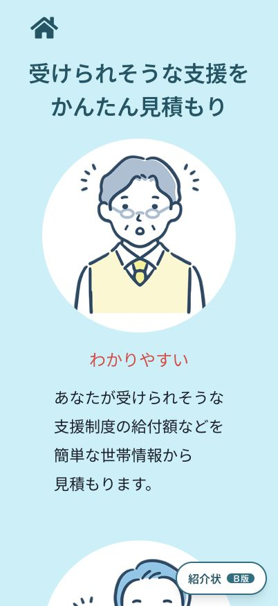 | 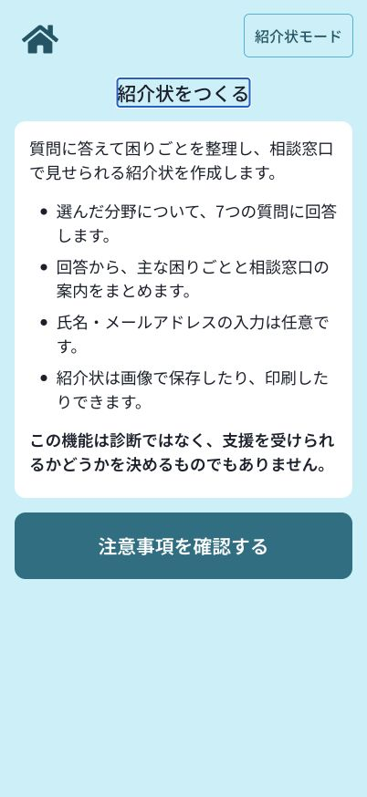 |
| 右下に固定された「紹介状 β版」から開始する。                                                | 機能の目的と作成できる内容を確認する。                                            |

| 3. 利用前の確認                                                                    | 4. 分野選択                                                                    |
| ---------------------------------------------------------------------------------- | ------------------------------------------------------------------------------ |
| 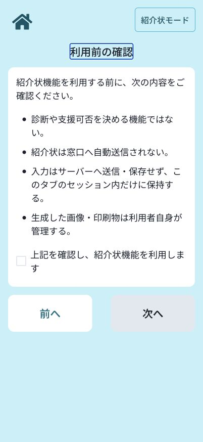 | 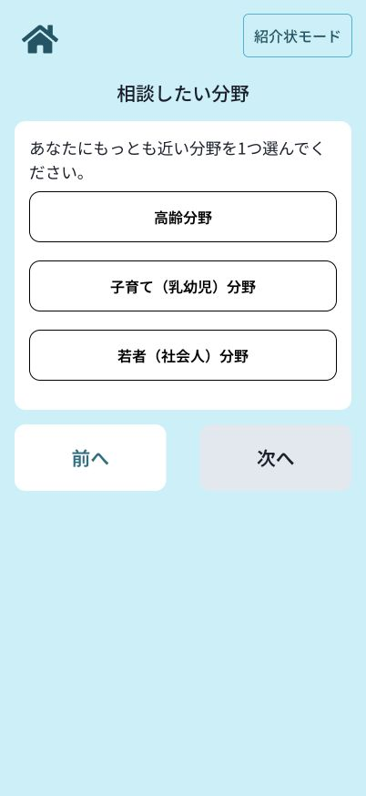 |
| 注意事項を確認して同意する。                                                       | 高齢・子育て・若者から1分野を選択する。                                        |

### 質問1〜7

| 5-1. お金                                                               | 5-2. 介護                                                               |
| ----------------------------------------------------------------------- | ----------------------------------------------------------------------- |
| 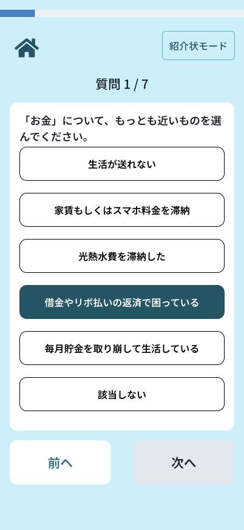 | 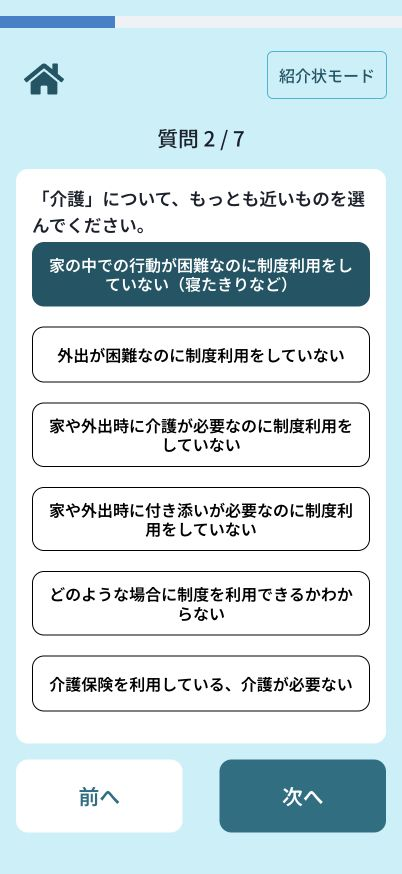 |

| 5-3. 移動                                                               | 5-4. 身体的健康                                                               |
| ----------------------------------------------------------------------- | ----------------------------------------------------------------------------- |
| 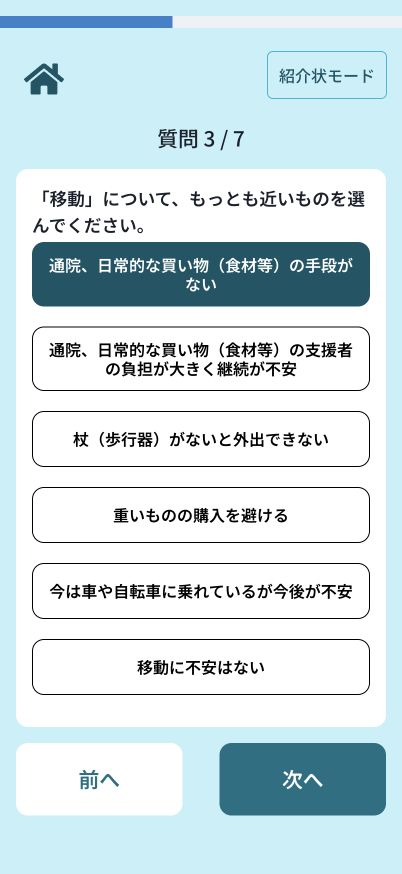 | 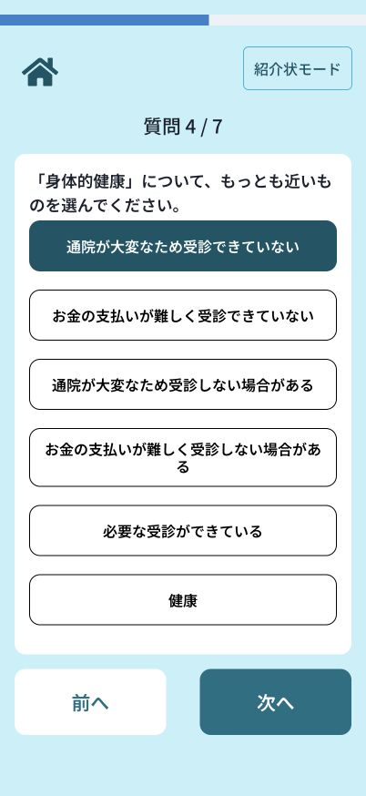 |

| 5-5. 地域とのつながり                                                               | 5-6. 家の片付け                                                               |
| ----------------------------------------------------------------------------------- | ----------------------------------------------------------------------------- |
| 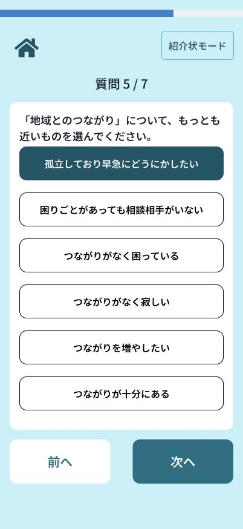 | 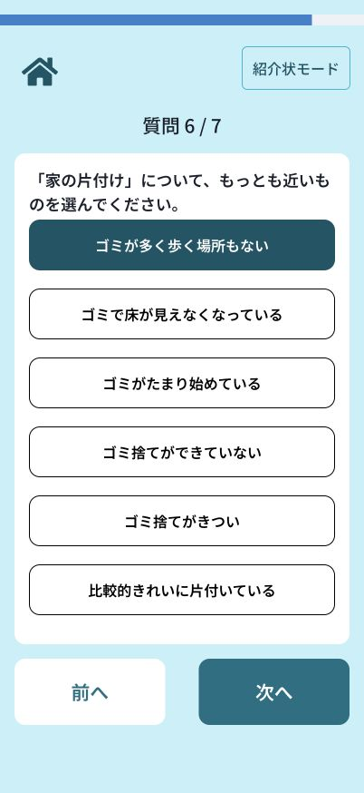 |

| 5-7. 精神的健康                                                               |                                                       |
| ----------------------------------------------------------------------------- | ----------------------------------------------------- |
| 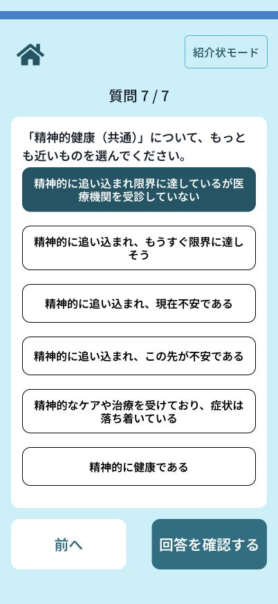 | 各質問で、現在の状況にもっとも近い回答を1件選択する。 |

| 6. 主な困りごと選択                                                                  | 7. その他の困りごと選択                                                                    |
| ------------------------------------------------------------------------------------ | ------------------------------------------------------------------------------------------ |
| 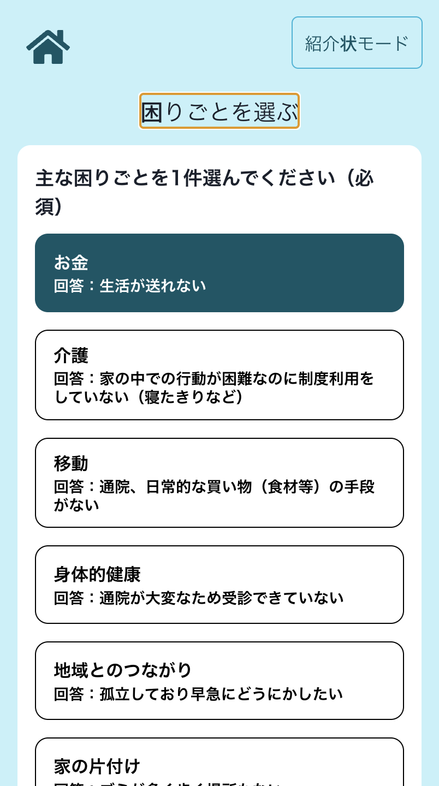 | 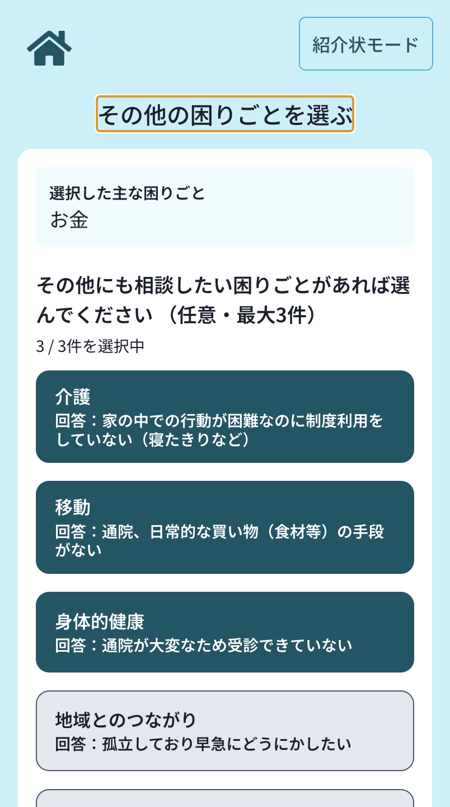 |
| 主な困りごとを必須で1件選択する。                                                    | 次の別画面で、その他の困りごとを任意で最大3件選択する。                                    |

| 8. 任意入力                                                                                           | 9. 完成画面                                                                          |
| ----------------------------------------------------------------------------------------------------- | ------------------------------------------------------------------------------------ |
| 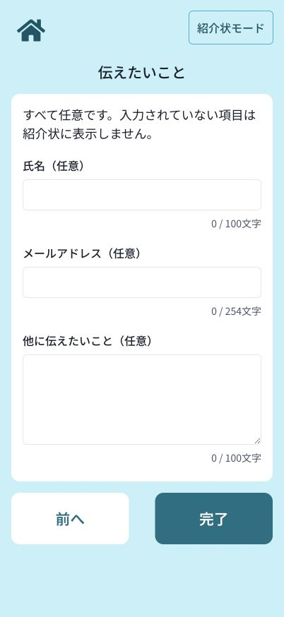 | 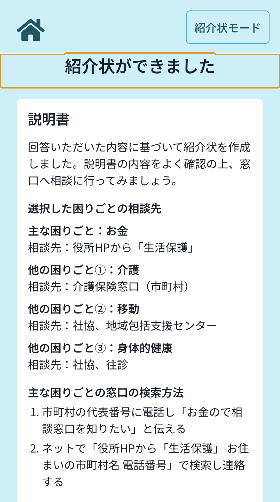     |
| 紹介状へ掲載する情報を必要に応じて入力する。                                                          | 緊急度は表示せず、回答に対応する相談先を確認して画像保存・印刷・回答編集などへ進む。 |

## 補足

- この一覧は、紹介状が生成される標準ルートを撮影したものです。
- 7問すべてで「該当しない」相当の回答を選んだ場合は、紹介状を生成せず「大きな困り事はなさそうです」画面へ分岐します。
- スクリーンショット内の回答は画面遷移確認用の例であり、推奨回答を示すものではありません。
