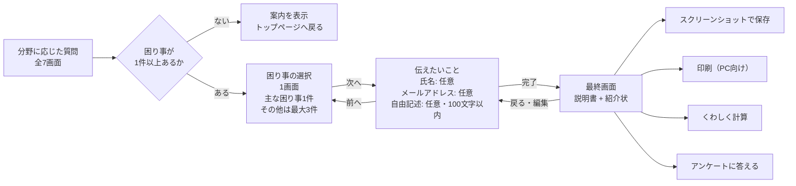
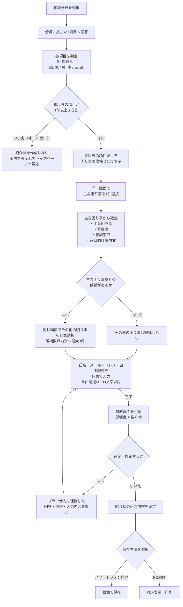

# 紹介状機能

## 概要

紹介状機能は、「支援みつもりヤドカリくん」で利用者の困り事を整理し、相談窓口へ持参できる紹介状として出力する機能である。

相談窓口へ自動送信する機能ではない。利用者自身が、スマートフォン向けの画像またはPC向けの印刷物として保存し、役所などの支援窓口で提示する。利用者が窓口で状況を一から説明する負担を減らし、窓口担当者が主な困り事、緊急度、その他の困り事を把握しやすくすることを目的とする。

## 想定する利用場面

- 利用者が、自分の困り事や相談先を整理したい。
- 利用者が、窓口で口頭だけでは状況を説明しにくい。
- 匿名で相談したい、対面で話すことが苦手など、事前に伝えておきたい事情がある。
- 窓口担当者が、主な相談内容だけでなく利用者の困り事の全体像を把握したい。

## 基本フロー

1. トップページから紹介状機能を開く。
2. 機能の説明を確認する。
3. 制限事項・利用規約等を確認し、同意する。
4. 相談したい分野を選択する。
5. 選択した分野に応じた7つの質問に回答する。
6. 1つの選択画面で、問題があると判定された項目から「主な困り事」を1つ、「その他の困り事」を最大3つ選択する。
7. 「伝えたいこと」画面で、氏名、メールアドレス、100文字以内の「他に伝えたいこと」を任意で入力する。
8. 「完了」を選択し、「説明書」と「紹介状」で構成される最終画面を表示する。
9. 最終画面を確認し、必要であればブラウザ内に保持した内容を編集する。
10. 「スクリーンショットで保存」または「印刷（PC向け）」を選択して保存する。
11. 保存した紹介状を相談窓口へ持参し、担当者へ提示する。

## 画面間の関係

Figmaの「最終画面」と直前画面の関係を、確定済みの「困り事の選択は1画面」という仕様に合わせて整理すると、次のとおりとなる。



| 画面 | 入力・表示内容 | 画面間の関係 |
| --- | --- | --- |
| 困り事の選択 | 主な困り事を1件、その他の困り事を最大3件選択する。 | 「次へ」で「伝えたいこと」へ進む。 |
| 伝えたいこと | 氏名、メールアドレス、他に伝えたいことを任意入力する。自由記述は100文字以内とする。 | 「前へ」で困り事の選択へ戻り、「完了」で最終画面へ進む。 |
| 最終画面 | 回答・選択・入力内容から生成した「説明書」と「紹介状」を表示する。 | 戻る・編集時はブラウザ内の保持内容を復元する。保存・印刷・次の機能への導線を表示する。 |

Figmaワイヤーフレーム上では「主なテーマを選択」と「サブテーマを選択」が別画面になっているが、本資料では確定済み仕様を優先し、両方を1つの困り事選択画面に統合する。

## 判定と選択のロジック

| 項目 | 内容 |
| --- | --- |
| 質問数 | 選択した分野について7項目に回答する。 |
| 緊急度 | 回答結果をもとに、主な困り事の緊急度を「低・中・高」で表示する。 |
| 色との対応 | 緑は低、黄は中、赤は高、青は問題なしとして扱う。 |
| 主な困り事 | 青以外、または点数が付いた項目から利用者が1つ選ぶ。 |
| その他の困り事 | 主な困り事を除いた、点数が付いた項目から最大3件を選ぶ。 |
| 紹介状への記載数 | 主な困り事1件とその他の困り事を合わせ、最大4件とする。 |
| 選択画面 | 主な困り事とその他の困り事を1つの画面で選択する。 |
| 該当項目が少ない場合 | 点数が付いた項目数に応じて選択可能数を減らす。1件だけなら主な困り事のみとする。 |
| すべて問題なしの場合 | 紹介状の作成には進まず、現在は大きな困り事がなさそうである旨を示してトップページへ戻す。 |

### 出力内容が確定するまでの条件分岐



保存方法の選択は、紹介状に記載する内容ではなく出力形式だけを変更する。画像と印刷のどちらを選んでも、確定済みの主な困り事、緊急度、その他の困り事、利用者情報、自由記述、相談窓口、案内文は同じ内容を使用する。

### 条件と出力項目の対応

| 条件 | 紹介状への反映 |
| --- | --- |
| 7項目がすべて青・点数なし | 紹介状を生成しない。案内を表示してトップページへ戻す。 |
| 青以外・点数ありの項目が存在する | 該当項目だけを主な困り事とその他の困り事の候補にする。 |
| 主な困り事を選択した | 選択したテーマ、回答から算出した緊急度、対応する相談窓口、窓口向け案内文を反映する。 |
| 主な困り事以外の候補がない | その他の困り事は追加しない。 |
| その他の困り事を選択した | 選択した項目だけを追加する。上限は3件とし、候補数が3件未満の場合は候補数までとする。 |
| 氏名・メールアドレスを入力した | 任意入力とし、入力された項目だけを利用者情報として反映する。 |
| 自由記述を入力した | 100文字以内の「他に伝えたいこと」として反映する。未入力の場合は内容を追加しない。 |
| 最終画面から修正を選択した | ブラウザ内に保持した回答・選択・入力内容を復元して編集し、再生成した最終画面で再確認する。 |
| 最終画面の内容を承認した | 紹介状の内容を確定し、保存方法の選択へ進む。 |

## 最終画面の構成

最終画面は、Figmaの「最終画面」（node `26:423`）を基準とする。上から「説明書」「紹介状」「保存・次の行動」の順で表示する。

### 1. 説明書

説明書は、利用者が自分の判定結果と相談先を理解し、窓口へ連絡するための案内である。

| 表示項目 | 内容 |
| --- | --- |
| 導入文 | 回答内容に基づいて紹介状を作成したことと、説明書を確認して窓口へ相談することを案内する。 |
| 判定結果 | 「①のあなたの緊急度は②です」という形式で、主な困り事と緊急度を表示する。 |
| 緊急度の説明 | 低・中・高の意味と、相談をどの程度推奨するかを表示する。 |
| 相談窓口 | 主な困り事に対応する③の窓口を表示する。 |
| 窓口の検索方法 | 市町村の代表番号へ問い合わせる方法と、インターネットで検索する方法を案内する。 |
| 相談時の伝え方 | ①の困り事について相談したい旨を窓口へ伝え、必要に応じて下部の紹介状を提示するよう案内する。 |

説明書の可変パラメータは次の3つとする。

| パラメータ | 差し込む内容 |
| --- | --- |
| ① | 主な困り事 |
| ② | 主な困り事の緊急度（低・中・高） |
| ③ | 主な困り事に対応する相談窓口 |

#### 表示文面

最終画面の導入文は、次の文面を使用する。

> 回答いただいた内容に基づいて紹介状を作成しました。説明書の内容をよく確認の上、窓口へ相談に行ってみましょう。

説明書本文はFigmaの文面を基準とし、①〜③を利用者の結果に応じて差し替える。

```text
「①」のあなたの緊急度は（② 低 中 高）です。
  高：ぜひ窓口に相談することを薦めます。
  中：窓口に相談してみてはどうですか
  低：自分の身を守るため知ってください

相談窓口：【③】の窓口

窓口の検索方法
①市町村の代表番号に電話し「【①】ので相談窓口を知りたい」と伝える
②ネットで「【③】 お住まいの市町村名 電話番号」で検索し連絡する

窓口に連絡し「【①】ので相談に乗ってほしい」と伝える
そのときに、画面に表示された「紹介状」もご利用ください
```

### 2. 紹介状

紹介状は、相談窓口の担当者が利用者の状況を把握するための情報を、次の順で表示する。

- この紹介状が「支援みつもりヤドカリくん」の回答から、支援につながりやすくする目的で作られたことを示す説明
- 氏名（任意）
- メールアドレス（任意）
- 主な困り事
- 主な困り事の緊急度と、その判定につながった回答
- その他の困り事（最大3件）
- その他の困り事ごとの緊急度と、その判定につながった回答
- 「他に伝えたいこと」（任意・100文字以内）
- 作成主体

主な困り事だけでなく、選択されたその他の困り事にもそれぞれの緊急度を表示し、周辺の課題を窓口担当者が把握できるようにする。

#### 表示文面テンプレート

Figmaの紹介状文面を基準に、確定済みのメールアドレスと「その他の困り事は最大3件」という仕様を反映したテンプレートは次のとおりとする。未入力の任意項目と、選択されていないその他の困り事は表示しない。

```text
※この紹介状は、アプリ「支援みつもりヤドカリくん」を使用し、
ユーザーの方が支援につながりやすいように作られました。

氏名（任意）：【氏名】
メールアドレス（任意）：【メールアドレス】

主な困りごと：【主な困り事】
緊急度：【低・中・高】（【判定につながった回答】）

他の困りごと①：【その他の困り事】
緊急度：【低・中・高】（【判定につながった回答】）

他の困りごと②：【その他の困り事】
緊急度：【低・中・高】（【判定につながった回答】）

他の困りごと③：【その他の困り事】
緊急度：【低・中・高】（【判定につながった回答】）

他に伝えたいこと（任意）：【自由記述】

作成：防窮研究会
```

### 3. 保存・次の行動

最終画面には、次の操作を表示する。

| 操作 | 役割 |
| --- | --- |
| スクリーンショットで保存 | スマートフォンで紹介状を画像として保存する。 |
| 印刷（PC向け） | PCで印刷用の表示を開く。 |
| くわしく計算 | 利用できる制度をより詳しく調べるモードへ進む。 |
| アンケートに答える | 改善のためのアンケートへ進む。 |

## 紹介状に含める情報

- 主な困り事
- 主な困り事の緊急度（低・中・高）
- その他の困り事
- 主な困り事に応じた相談窓口と、その窓口への相談を促す文面
- 氏名（任意）
- メールアドレス（任意）
- 「他に伝えたいこと」の自由記述（任意・100文字以内）
- 紹介状の目的や使い方を示す説明
- 作成主体

相談窓口、案内文、窓口へ伝える文面は固定ではなく、利用者が選んだ主な困り事に応じて差し替える。

機能の説明文と紹介状の文面、最終画面の構成は、Figmaの「最終画面」（node `26:423`）を正とする。ただし、Figma上の電話番号欄は確定済み仕様に合わせてメールアドレス欄へ変更し、その他の困り事は最大3件まで表示できるようにする。

## 自由記述と編集

自由記述欄は、質問への回答だけでは表現しにくい事情を利用者が補足するために設ける。想定例は次のとおり。

- 匿名で相談したい。
- 対面で話すことが苦手である。
- 口頭では伝えにくい健康上・生活上の事情がある。

多くの利用者は自由記述を使わない可能性があるため、任意入力とし、上限を100文字とする。紹介状の最終画面を見た後から追記・修正できる導線を用意する。

## 保存方法

最終画面で、次の2つの保存方法を提示する。

| 保存方法 | 主な対象 | 方向性 |
| --- | --- | --- |
| スクリーンショットで保存 | スマートフォン利用者 | OSのスクリーンショット操作だけに依存せず、紹介状を画像としてダウンロードできる形を検討する。 |
| 印刷（PC向け） | PC利用者 | PDF表示または印刷を行える形式とし、A4での利用を想定する。 |

スマートフォン利用を基本とする。説明書と紹介状を可能な限り1枚にまとめ、読みにくい場合は2枚構成を再検討する。印刷版では、説明書と紹介状をA4の上下に配置し、必要に応じて切り取り線を設ける案がある。

## 実装・UI共通化方針

紹介状機能は、既存の見積もり機能へ直接組み込まず、機能単位でフォルダを分けて実装する。一方で、画面の見た目と基本操作は既存機能と揃えるため、共通化できるUIコンポーネント、Chakra UIのテーマ、文字サイズ等のスタイル設定は再利用する。

### フォルダと責務の分離

紹介状固有の画面、状態、条件分岐、文面、型定義は、`dashboard/src/components/referral-letter/` 配下へまとめる。想定する構成は次のとおりとする。

```text
dashboard/src/components/referral-letter/
├── screens/       # 説明、質問、困り事選択、伝えたいこと、最終画面
├── components/    # 緊急度表示、紹介状カードなど紹介状固有のUI
├── hooks/         # 画面遷移、判定、ブラウザ内保持
├── state.ts       # 紹介状機能内で完結する状態
├── config.ts      # 質問、相談窓口、差し込み文面
└── types.ts       # 回答、困り事、紹介状出力の型
```

| 対象 | 方針 |
| --- | --- |
| 画面とルーティング | 紹介状の画面実装は専用フォルダへ置き、ルート登録のみ既存の `dashboard/src/App.tsx` へ追加する。 |
| ビジネスロジック | 紹介状の判定・選択・文面生成を、既存の `forms/` や `result/` へ混在させない。 |
| 状態管理 | 紹介状の回答・選択・入力内容は紹介状用の状態として管理し、既存の見積もり用Recoil stateへ依存させない。ブラウザ内の保存キーも紹介状専用の名前空間にする。 |
| 設定値 | 質問、緊急度、相談窓口、紹介状文面は紹介状用の設定へ分離する。既存の `app_config.json` からは共通のスタイル設定だけを利用する。 |
| 依存方向 | 紹介状機能から共通UIを参照する。既存の見積もり機能から紹介状固有のコンポーネントや状態は参照しない。 |

この分離により、紹介状機能を追加・変更しても、既存の「かんたん見積もり」「くわしく見積もり」「災害支援見積もり」の画面遷移、計算状態、結果表示へ影響しにくい構成とする。

### 共通コンポーネントの利用

同じ役割と見た目を持つUIは複製せず、既存コンポーネントを再利用する。既存コンポーネントが見積もり機能固有の状態に依存している場合は、見た目と操作を担う共通部分を切り出し、各機能から利用する。

| 既存実装 | 利用方針 |
| --- | --- |
| Chakra UIと `dashboard/src/main.tsx` のテーマ | 背景色、フォント、色、余白、角丸、レスポンシブ設定をそのまま利用する。 |
| `dashboard/src/components/layout/narrowWidth.tsx` | PCで画面幅を抑える共通レイアウトとして利用する。 |
| ホーム、戻る、次へ、完了のナビゲーション | ボタンの外観と配置を共通化する。既存状態の初期化処理とは分離し、紹介状側の状態を意図せず変更しないようにする。 |
| 質問・選択肢のUI | 既存の質問カード、選択ボタン、エラー表示と同じフォーマットにする。既存の `SelectionQuestion` 等が見積もり用stateに依存する部分は直接流用せず、表示コンポーネントを共通化して利用する。 |
| 利用規約・説明のモーダル | 内容と同意条件が共通なら既存の枠組みを利用する。紹介状固有の文面は紹介状側の設定として渡す。 |

新たに作成したコンポーネントが紹介状以外でも同じ意味で利用できる場合は、紹介状フォルダ内へ残さず、`dashboard/src/components/` 配下の共通領域へ切り出す。紹介状固有の用語、判定、データ形式を含むコンポーネントは共通化しない。

### UIフォーマット

紹介状モードも既存画面と同じアプリの一部として見えるよう、次のフォーマットを揃える。

- Chakra UIを利用し、独自のUIライブラリを追加しない。
- `Noto Sans JP`、`cyan.100`の背景、既存のカラーパレットとレスポンシブの文字サイズを利用する。
- 見出し、説明、白いカード、選択ボタン、入力欄、エラー表示、前後移動ボタンの余白・角丸・文字サイズを既存画面に合わせる。
- スマートフォンを基準に設計し、PCでは既存の狭幅レイアウトを利用する。
- Figmaの構成と文面を再現しながら、UIパーツの見た目は既存コンポーネントとデザイントークンを優先する。
- 同じ操作には同じラベル、色、配置、フォーカス表示を使用し、紹介状モードだけ異なる操作感にしない。

共通コンポーネントの変更時は、紹介状画面だけでなく既存の見積もり画面でも表示と操作を確認し、既存機能の見た目や挙動を変えていないことを検証する。

## データ保持に関する前提

ヤドカリくんのサーバー側では、入力内容や生成した紹介状を保存しない。共有URL方式はサーバー側でデータを保持する必要が生じるため、今回の基本案には含めない。

最終画面から編集画面へ戻る場合に備え、回答、困り事の選択、氏名、メールアドレス、自由記述はブラウザ内に保持する。編集後は保持した内容から紹介状を再生成する。

利用者は、生成された画像または印刷物を自分で保管する。氏名、メールアドレス、自由記述にはセンシティブな情報が含まれる可能性があるため、生成物の扱いについて画面上で注意を示す必要がある。

## 打ち合わせで合意した方向性

- 既存のヤドカリくんに、PCとスマートフォンの両方で利用できる紹介状機能を追加する。
- トップページ上の名称は「紹介状」とする。
- 機能説明と利用規約等への同意を経て、質問回答へ進む。
- 7つの回答結果から、1つの画面で主な困り事を1件、その他の困り事を最大3件選択する。
- 主な困り事には緊急度を表示する。
- 問題なしの項目は、困り事の選択肢に表示しない。
- 氏名、メールアドレス、100文字以内の自由記述を任意入力できるようにする。
- 主な困り事に応じて、相談窓口と案内文を切り替える。
- 機能の説明文と紹介状の文面、最終画面の構成は、Figmaの「最終画面」（node `26:423`）を正とする。
- スマートフォン向けの画像保存と、PC向けの印刷保存を提供する。
- 紹介状の信頼性を示すQRコードまたは署名相当の情報を設ける。
- 入力内容はサーバー側に保存せず、編集に必要な内容をブラウザ内に保持する。
- 紹介状固有の実装は専用フォルダへ分離し、既存機能と状態・条件分岐を混在させない。
- UIは既存の共通コンポーネントとテーマを利用し、既存画面と同じフォーマットにする。

## 今回確定した事項

| 論点 | 確定内容 |
| --- | --- |
| トップページ上の名称 | 「紹介状」とする。 |
| その他の困り事の上限 | 最大3件とする。 |
| 困り事の選択画面 | 主な困り事とその他の困り事を1つの画面で選択する。 |
| 氏名・連絡先の扱い | 氏名とメールアドレスを任意入力とする。Figma上の電話番号欄はメールアドレス欄へ変更する。 |
| 自由記述 | 任意入力とし、100文字以内とする。 |
| 説明文と紹介状文面 | Figmaの「最終画面」（node `26:423`）を正とする。 |
| 編集導線 | 回答・選択・入力内容をブラウザ内に保持し、最終画面から戻った際に復元する。 |
| 実装構成 | 紹介状固有の画面・状態・ロジック・設定を `dashboard/src/components/referral-letter/` 配下へ分離する。 |
| UI共通化 | 既存の共通コンポーネント、Chakra UIテーマ、スタイル設定を利用し、既存画面と同じフォーマットにする。 |

## 残る未決事項

| 論点 | 状態 |
| --- | --- |
| QRコード | 遷移先、掲載内容、責任主体を確定する。 |
| 画像出力 | 1枚画像としてダウンロードする技術方式と、端末上での見やすさを検証する。 |
| 印刷レイアウト | A4 1枚の上下配置、2枚構成、切り取り線の要否を検証する。 |

## 情報源

- [トヨタ財団MTG - 2026/03/09 16:53 JST - Gemini によるメモ](https://docs.google.com/document/d/14YcOqRqqFuq1l_3IbaJ65No65ieNKyN0fdQyJVIkxnI/edit?tab=t.6cnes59mdye0)
- [Figma「トヨタ財団_紹介状」最終画面（node 26:423）](https://www.figma.com/design/q1y7X0JdiWyyIECwmmq3pP/%E3%83%88%E3%83%A8%E3%82%BF%E8%B2%A1%E5%9B%A3_%E7%B4%B9%E4%BB%8B%E7%8A%B6?node-id=26-423)

Googleドキュメントの「メモ」タブと「文字起こし」タブを照合して整理した。文字起こしは自動生成であり誤りを含む可能性があるため、発言が揺れている内容は未決事項として扱っている。
